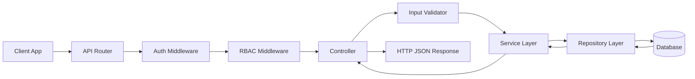
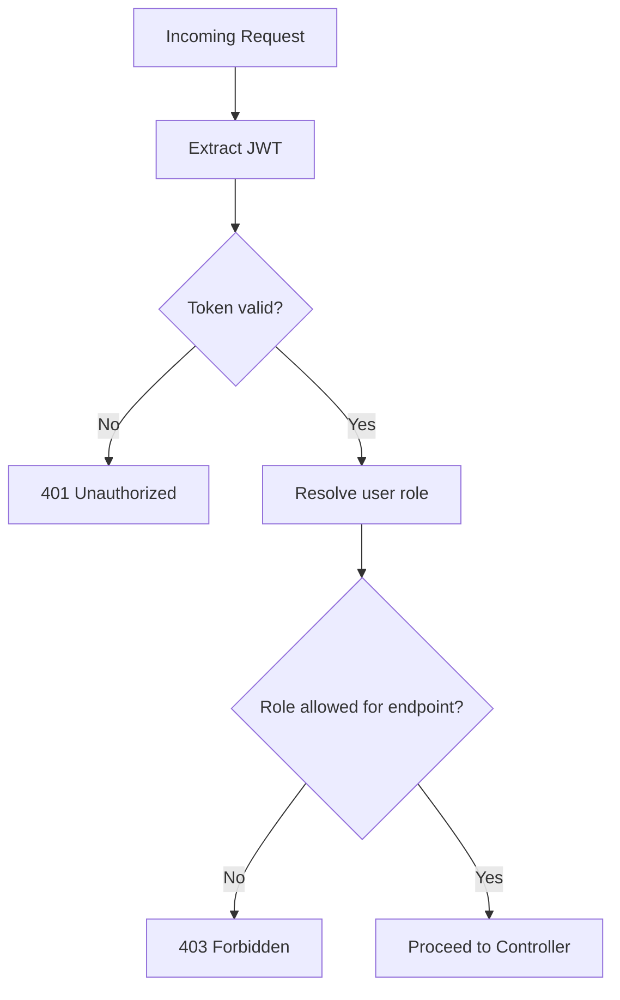
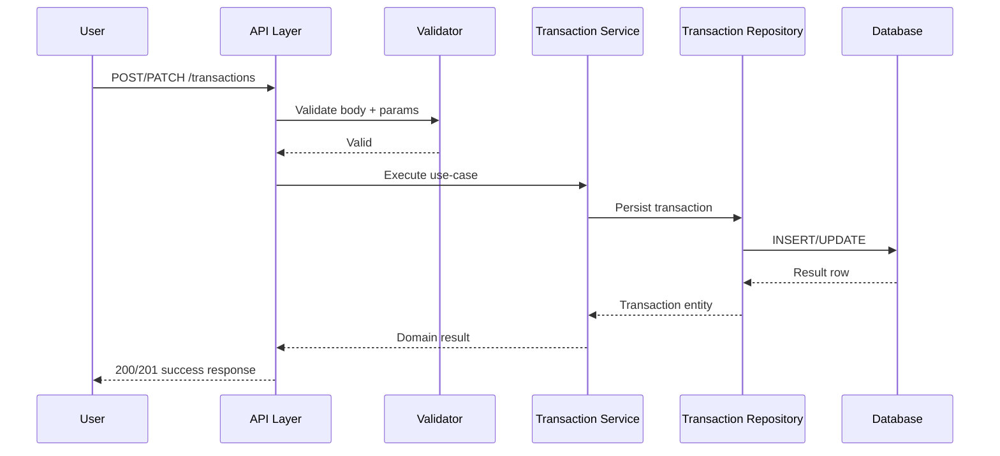
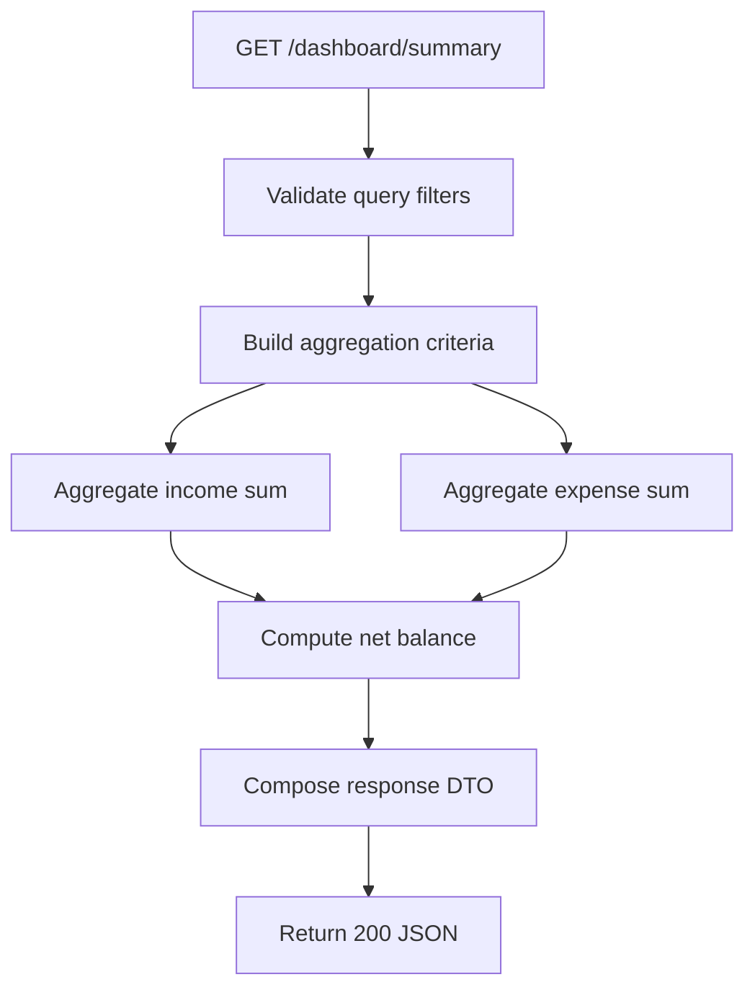
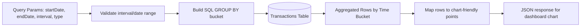
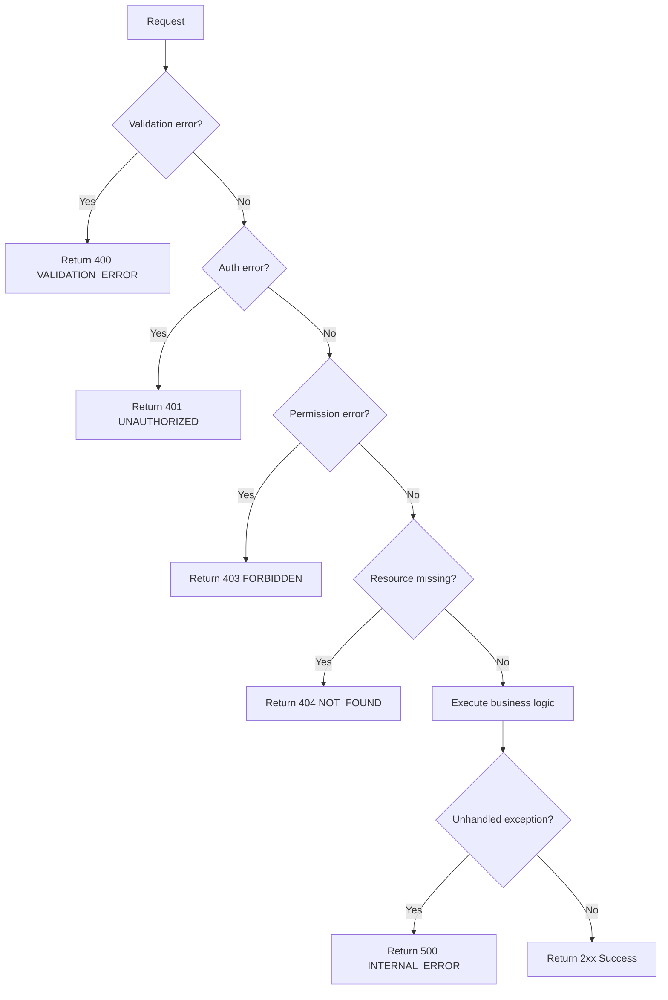
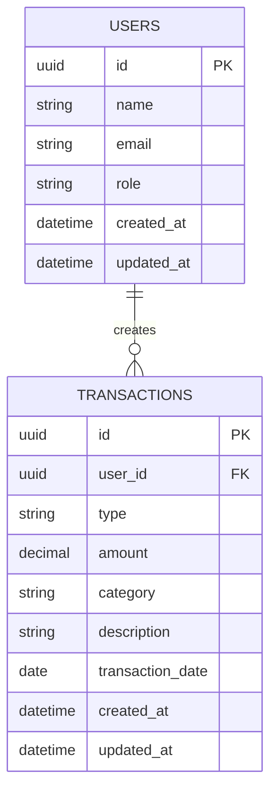

# Finance Dashboard Backend - Flows and Data Diagrams

## 1) High-Level Request Flow

## 2) RBAC Decision Flow

## 3) Transaction Create/Update Flow

## 4) Dashboard Summary Aggregation Flow

## 5) Trends Data Flow (Day/Week/Month)

## 6) Error Handling Flow

## 7) Data Model ER Diagram (Logical)

